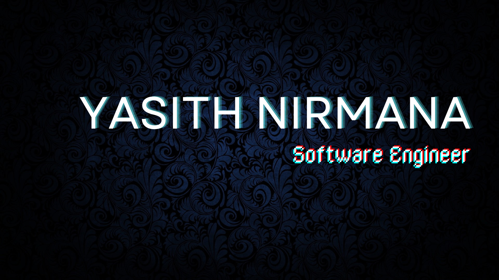

<!-- ### Hi there 👋 -->

<h1 align="center">Hi, I'm Yasith Nirmana👋</h1>

<h3 align="center">A Fullstack Software Engineer</h3>

I am a passionate software engineer specializing in web application design and development. With a keen eye for detail and a commitment to creating efficient, scalable, and user-friendly web solutions, I enjoy turning complex problems into intuitive and performant applications. My expertise spans across various modern web technologies, and I am always eager to learn and adapt to new tools and methodologies. Let's build something great together!

    

  

<!-- - 🔭 I’m currently working on  -->
- 🌱 I’m currently learning Business Administration
- 💼 My protfolio available at **https://yasithnirmana.github.io/dev-yasith/**
- 👯 I’m looking to collaborate on web development projects for companies.
<!-- - 🤔 I’m looking for help with ...
- 💬 Ask me about ... -->
- 📫 How to reach me: **yasithnirmana99@gmail.com**
